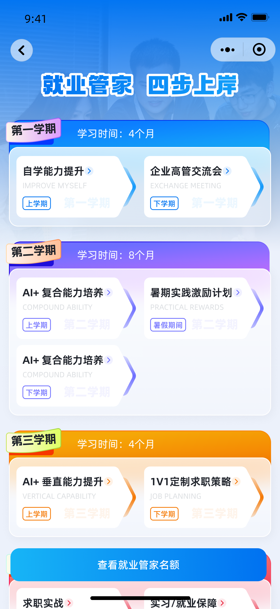
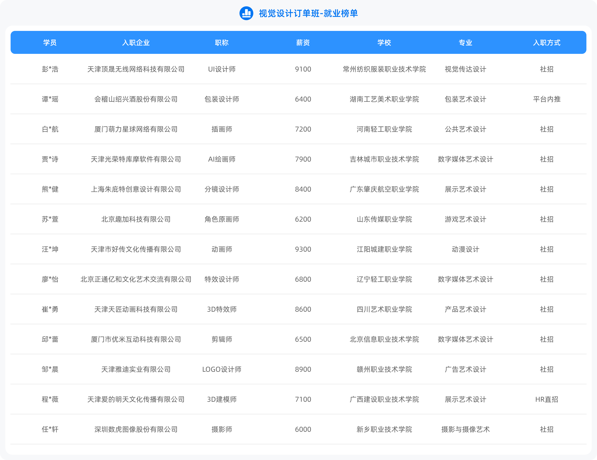
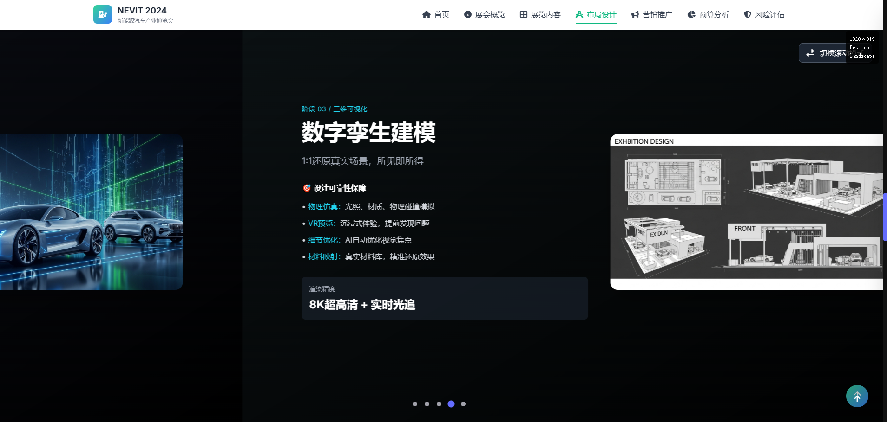
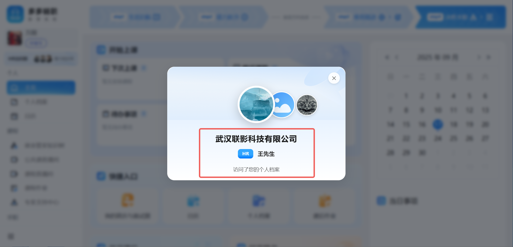

# 多多畅职产品介绍

## 迷茫

### 从迷茫开始

- 你知道自己的专业可以找到什么工作吗？
    
    - 小程序“专业测评”

### 就业的恐惧
- 万一找不到工作怎么办？
- 普通专科生的就业现状：吉祥三宝/铁人三项/主播、销售路、服务员．

### 学校学习
- 学校学习的知识偏理论，教材落后

### 校招情况
- 校招来的企业较差，基本以销售或客服为主

## 产品介绍

### 简介

- 我们的 **“企业订单班”** 可以让你在找工作的时候**快人一步**
- 这是**央视报道**的新型就业服务平台
- 我们的“企业订单班”与2700家企业合作、与企业共同教学，共同管理，共同就业

图片信息：小程序“轮播图”

### 企业资源多

- 合作企业多

图片：小程序“订单班-企业链接计划”

### 岗位种类多

- **企业的很多好岗位是不对社会公开招聘的**，我们合作的企业前50％岗位只从我们的学员里挑选
- 每个“企业订单班”都是**对标40多个岗位**，有很多都是你在学校学的专业去不了的岗位

图片信息：就业榜

### 只学有用的

- 各大企业会派驻**专家**在我们的教务平台给大家上课**什么技术有用教什么，什么工资高教什么**

图片信息：教务系统截图

### 学习AI最新应用

- **专科生唯一能逆风翻盘的法宝就是AI的应用能力**“订单班”各行业的专家会教授学员AI在工作中的各种最新应用，AI应用能力是当下企业在招聘中的重要参考条件
- AI不难学，你只要输入一些简单的命令，我们的“多多智能体”便**可以轻松的生成一整套的项目方案**，便于掌握“项目经验”，便于打造“个人作品”

图片信息：多多agent

### 入学即跨入职场

- 你在上课的过程中，**企业HR**也会在平台上随时关注你
- 实习或毕业的时候我们会给你**内推岗位**，当你的同学不知道怎么找工作的时候，而你却在我们给你内推的岗位中 **“挑选工作”**

图片信息：教务中的hr访问

### 定制化服务

- 你知道找工作有多**麻烦**吗？需要准备很多材料的，而且你也写不到点上

#### 简历：
- 找不同的工作就得写不同的简历，每份简历都得按照企业的招聘要求来写，写的不好企业直接丢垃圾桶这些简历我们的**专家会帮你**写好

图片信息：简历与面试题

#### 项目经验：

- 找工作的时候企业一般会问你有没有项目经验，这就要求你寒暑假得去企业里边干活边了解而我们在课堂上就会教你不同的项目案例，专家也会把项目案例整理好发给你，你**不用寒暑假打工**就能有一定的项目经验了

图片信息：我的项目库

#### 作品：

- 简历被企业录用后，企业还会让你提供作品，一般我们学校的学生都拿不出手而你的作品我们的企业专家会**提前帮你**做好

图片信息：我的作品集

#### 面试：

找工作只有一个考试，那就是面试我们学校的很多同学第一次面试的时候都紧张的说不出话来，一方面是因为肚子里没东西，另一方面是因为根本不知道面试的规则与套路而我们在苏州的线下城市站点有**面试培训**，到你快找工作的时候培训几次就能游刃有余面试了

图片信息：线下面试规划

问：不是有内推岗位吗？怎么还要准备简历、作品这些材料？ 
答：所有的招聘都需要走流程，这些材料是你和企业相互了解的**前提**

## 大一推广介绍

### 大专生尴尬处境

- 比技能吧，比不过技校，他们早就开始实操学技术了，我们还在学语数外比学历吧，比不过985／211一流本科，他们可以去考公考编考研等，未来路径也比大专多而大专生能走的路只有一条，那就是再考本科，那万一考不上呢？苏州每年**专升本的录取率只有15％**，有教育厅发的文件，自己可以查，没有转本机构宣传的9５％以上的录取率

### 转本文凭也找不到好工作

- 社会上承认的具有含金量的学历是985／211的本科学历，**专升本的学历没有任何含金量**，大多数考上的本科都是民办本科，而且本科毕业证上会注明（专科起点／专转本／二年制）等字样
- 虽说转本后可以考公考编，但是**考公考编的难度**比你高考考个一本都要难，录取率在1-2％左右
- 转本的代价很高：
    1.学费高；
    2.学习周期长；
    3.考试数量多；
    4.对口就业的岗位并没有增加；
    5.薪资并不会提高；
    6.岗位晋升空间并不大

图片信息： 专升本对比图

### 学校课程难学

- 高中三年学三门语数外都学不好，大专两年要学十几二十门课，而且都是基础理论课，很难学的精

### 学校教学落后

- 只要你找工作的时候就会发现，大学里老师教的知识都是远远落后于企业的新技术，因为**老师自己都没有进过企业**工作过，怎么知道现在企业最新应用的设备，新技术等等

## 给大二推广介绍

### 家里有关系

- 家里有关系的，能够介绍工作固然好，但也得自己有本事，不然**很难在企业留得住**，我们身边太多同学是靠家里关系找到工作的，但因为个人能力不行，进了企业要么干不了几个月被轰出来，要么只能去一些边缘岗位，薪资少得可怜

### 大二换专业

- 很多大二的同学面对自己的专业根本学不进去，问题就出在通过一年的大学学习，他发现不喜欢自己所学的专业，但是学校又不能随便换专业，而我们的“订单班”给了同学**重新选择专业**的机会

### 大三实习

- 大三的时候，如果专业学习不精的话，根本**找不到像样的实习工作**，与其去端盘子或打螺丝，不如花点时间好好学习“订单班”的知识，同样干一个月能拿七八千，何必累死累活拿两三千

### 一起上班

- 考虑到同学毕业第一次工作的时候有“孤单感”，我们的“订单班”内推岗位会为同校同班的同学优先推送相同岗位，这样好友就可以一起去**同一家企业上班**

## 报名

### 名额规则介绍

- 因为企业**专家资源有限**，12个“企业订单班”，一届只能在全省招生2400人，平均每班只能招生200人，苏州12个“企业订单班”的总名额为319人，平均每班只招20多人
- 具体名额需要学生小程序查看每校的**名额分配**

图片信息：

### 代理连线销售客服

- 特殊情况：若名额用完，可连线销售客服能否从其它城市调剂名额，无法调剂请为学生表示歉意
- 重要：大一新生在没有名额的情况下，不能锁定下一年度的名额

联系方式：电话连线

### 营销案例

- 很多同学都是父母带过来报名的
- 产品非常实用，代理自己也买了

### 名额锁定

- 预付定金
- 重要：**定金不退**还告知
- 开学日期说明
- 电子版协议签约

演示：小程序“电子签”

### 付款

- 交付定金后，再扫小程序代理的“报名”二维码（**20min内**），录入CRM系统
- 重要：3日内付清尾款，否则名额转让给其他同学，且不退定金
- 交付报名通知书
- 帮助学员教务系统下载及安装

## 城市站点

### 指导老师

- 城市站点的指导老师给学生分析所学专业的**未来的就业情况**

### 老师点评

- 专业点评：
专业的学习特性（学习**难易**程度）（2min）
专业的就业特性（技能应用的**广度**范围/**行业**发展状况）——3min

        SaaS系统“专业点评”

图片信息：Saas系统专业点评

### 老师选班

- 学习建议：建议拓展技能，储备相关项目经验——1min
- 选班建议：**推荐理由**（2min）
          
          SaaS系统“推荐理由”

图片信息：Saas系统推荐理由

### 老师教务系统演示 

- 演示：**简历**/项目/**作品**/面试/内推**岗位**（5min）